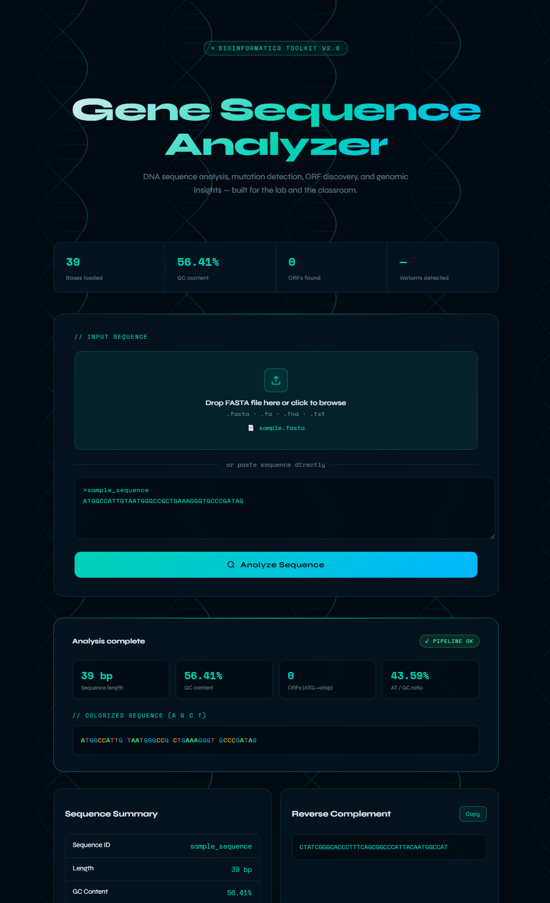
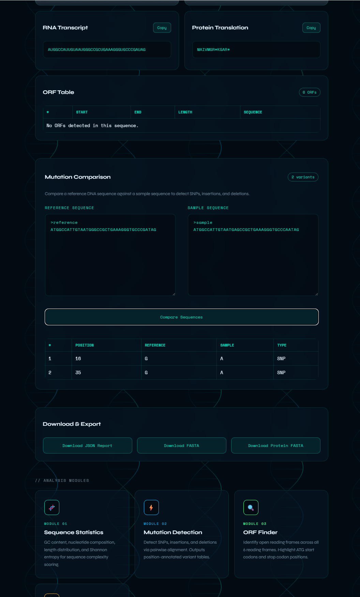

# Gene Sequence Analyzer

Interactive bioinformatics platform for DNA sequence analysis, mutation detection, ORF discovery, and protein translation.

## Live Demo

https://gene-analyzer.up.railway.app/

## Screenshots

### Main Interface



### Mutation Comparison



## Features

- FASTA file upload and direct sequence input
- DNA sequence statistics and GC content analysis
- Reverse complement generation
- RNA transcription
- Protein translation
- Open Reading Frame (ORF) detection
- Mutation comparison between reference and sample sequences
- JSON and FASTA export functionality
- Interactive genomics-inspired UI with animated DNA visualization

## Tech Stack

### Backend
- Python
- Flask
- BioPython

### Frontend
- HTML
- CSS
- JavaScript

### Deployment
- Railway

## Bioinformatics Functionality

The platform supports:
- nucleotide sequence validation
- sequence composition analysis
- ORF scanning
- mutation identification
- transcription and translation workflows

Mutation comparison detects:
- SNPs
- insertions
- deletions

## Project Structure

```text
Gene-Sequence-Analyzer/
│
├── data/
│   ├── reference.fasta
│   ├── sample.fasta
│   └── sample_mutated.fasta
│
├── pipeline/
│   ├── ingest.py
│   ├── mutations.py
│   ├── orf_finder.py
│   ├── qc.py
│   ├── report.py
│   ├── sequence_stats.py
│   └── sequence_tools.py
│
├── results/
│   ├── base_composition.png
│   └── mutation_report.csv
│
├── static/
│   ├── script.js
│   └── style.css
│
├── templates/
│   └── index.html
│
├── uploads/
│
├── app.py
├── main.py
├── Procfile
├── README.md
└── requirements.txt
```

## Running Locally

Clone the repository:

```bash
git clone https://github.com/ss-dngch/Gene-Sequence-Analyzer.git
cd Gene-Sequence-Analyzer
```

Create a virtual environment:

```bash
python -m venv venv
```

Activate the environment:

### Windows

```bash
venv\\Scripts\\activate
```

Install dependencies:

```bash
pip install -r requirements.txt
```

Run the application:

```bash
python app.py
```

Then open:

```text
http://127.0.0.1:5000
```

## Future Improvements

- BLAST integration
- NCBI accession lookup
- ClinVar / VEP variant annotation
- Alignment visualization
- VCF upload support
- Advanced mutation highlighting

## Author

Sophia Sipayboun

Computer Science graduate and Bioinformatics MS student focused on genomics, computational biology, and biomedical data analysis.
